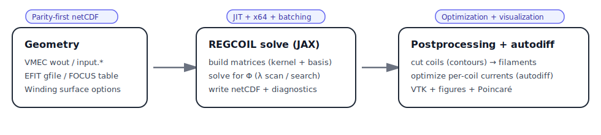
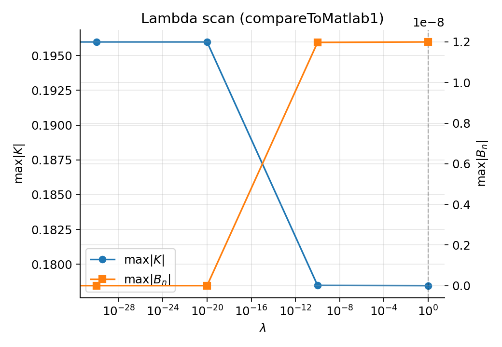
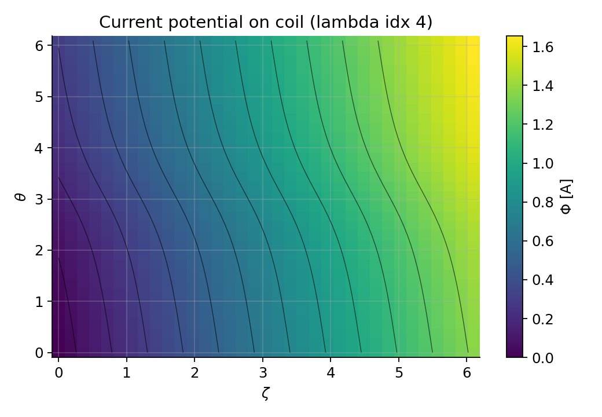

# regcoil_jax

**REGCOIL, reimplemented in JAX**: fast, differentiable, and regression-tested against the reference Fortran output.

Goals:

1. **Parity-first correctness**: match Fortran netCDF schema + values for a curated set of inputs.
2. **JAX-native workflows**: JIT compilation, autodiff, and optimization-ready APIs (without Fortran adjoints).
3. **Practical visualization**: publication-quality figures + ParaView outputs (VTK/VTU) and field-line/Poincaré tools.



Example outputs (from `examples/1_simple/regcoil_in.compareToMatlab1`):





## Features

- CLI that mirrors REGCOIL’s “input file → output netCDF + log” workflow.
- Geometry:
  - Plasma ``geometry_option_plasma``: ``{0,1,2,3,4,5,6,7}`` (VMEC, EFIT, tables, FOCUS).
  - Coil ``geometry_option_coil``: ``{0,1,2,3,4}`` (analytic torus, VMEC offsets, NESCOIL surfaces).
- Regularization terms: ``{"chi2_K","K_xy","K_zeta","Laplace-Beltrami"}``.
- Execution modes: ``general_option`` in ``{1,2,3,4,5}`` (scan, diagnostics, SVD scan, lambda search).
- Sensitivity outputs: ``sensitivity_option>1`` writes winding-surface Fourier-coefficient sensitivities (``dchi2domega``) using autodiff.
- Coil cutting into filament sets, per-coil currents, Biot–Savart field evaluation, and Poincaré sections.

Notes:

- ``geometry_option_plasma=4`` (VMEC straight-field-line poloidal coordinate) is implemented in a radians-consistent form.
  The bundled Fortran reference in this workspace is known to fail for typical VMEC files due to an angle/units inconsistency,
  so this option is smoke-tested rather than netCDF-parity-tested.
- ``geometry_option_plasma=5`` (EFIT): netCDF parity is regression-tested for ``efit_psiN=1.0`` (LCFS). For ``efit_psiN<1``,
  this port uses a coarse-grid interpolation approximation (documented).

## Install

Editable install for development:

```bash
pip install -e '.[dev]'
```

## Quickstart (CLI)

Run a few curated examples:

```bash
regcoil_jax --platform cpu --verbose examples/1_simple/regcoil_in.compareToMatlab1
regcoil_jax --platform cpu --verbose examples/1_simple/regcoil_in.compareToMatlab1_option1
regcoil_jax --platform cpu --verbose examples/3_advanced/regcoil_in.lambda_search_1
```

`--verbose` prints a Fortran-style progress log (surface initialization, matrix build phases, and per-λ diagnostics).

For more accurate (synchronous) timing of matrix-assembly phases (slower), set:

```bash
export REGCOIL_JAX_SYNC_TIMING=1
```

Outputs are written **next to the input file**:

- ``regcoil_out.<case>.nc``
- ``regcoil_out.<case>.log``

## Quickstart (figures + ParaView)

Run + postprocess into figures and VTK outputs:

```bash
python examples/3_advanced/postprocess_make_figures_and_vtk.py --run --input examples/3_advanced/regcoil_in.lambda_search_1
```

End-to-end demo (solve → cut coils → field lines → Poincaré):

```bash
python examples/3_advanced/full_solve_cut_coils_and_poincare.py
```

## JAX-native demos (autodiff)

Toy optimization on a fast kernel:

```bash
python examples/2_intermediate/jax_optimize_coil_minor_radius.py
```

Differentiate through geometry → matrices → solve:

```bash
python examples/2_intermediate/jax_optimize_coil_radius_full_regcoil.py
python examples/3_advanced/jax_optimize_separation_vmec_offset.py
```

Optimize per-coil currents after cutting (autodiff through Biot–Savart):

```bash
python examples/2_intermediate/jax_optimize_cut_coil_currents_and_visualize.py
```

Robust per-coil current optimization under coil misalignments (vmap + autodiff):

```bash
python examples/3_advanced/jax_robust_optimize_cut_coil_currents_misalignment.py
```

Optimize a global rigid coilset alignment (geometry parameters via autodiff):

```bash
python examples/3_advanced/jax_optimize_coilset_rigid_alignment.py --optimize_currents_first
```

Hybrid (few loops + many dipoles) B·n optimization + Poincaré:

```bash
python examples/3_advanced/hybrid_few_loops_many_dipoles_optimize_and_poincare.py
```

JAX-native fieldline tracing + soft Poincaré gradients (demo):

```bash
python examples/3_advanced/jax_poincare_grad_demo.py
```

Optimize per-coil currents with a differentiable (soft) Poincaré penalty:

```bash
python examples/3_advanced/jax_optimize_currents_with_differentiable_poincare.py
```

Quadcoil-style ∇Φ diagnostics (coil spacing / total coil length estimates) + optional coil cutting:

```bash
python examples/3_advanced/quadcoil_style_spacing_length_scan.py --cut_coils
```

Permanent magnets (dipole lattice) to cancel ``Bnormal_from_plasma_current``:

```bash
python examples/3_advanced/permanent_magnets_cancel_bplasma.py
```

Real-geometry stellarator demos (VMEC):

```bash
python examples/3_advanced/stellarators/LP2021_QA/run_qa_coil_design.py
python examples/3_advanced/stellarators/LP2021_QA/run_qa_dipole_fit.py
```

Differentiable coil cutting (approximate relaxation):

```bash
python examples/3_advanced/differentiable_coil_cutting_softcontour.py
```

Differentiable multi-coil cutting (topology-fixed “snakes” relaxation):

```bash
python examples/3_advanced/differentiable_coil_cutting_snakes_multicoil.py
```

## Tests / Parity

Run the main test suite:

```bash
pytest -q
```

Run slow/high-resolution example tests:

```bash
REGCOIL_JAX_RUN_SLOW=1 pytest -q
```

Reference Fortran netCDF outputs are stored in ``tests/fortran_outputs/`` so CI does not require Fortran.

## Documentation

User documentation lives in ``docs/`` (Sphinx). Key pages:

- ``docs/usage.rst``: inputs and CLI usage
- ``docs/theory.rst``: equations and code mapping
- ``docs/parity.rst``: what is checked and how to regenerate baselines
- ``docs/visualization.rst``: figures + ParaView outputs
- ``docs/quadcoil_objectives.rst``: coil spacing/length diagnostics from ∇Φ
- ``docs/permanent_magnets.rst``: dipole lattice workflows
- ``docs/contributing.rst``: dev install, tests, parity baselines
