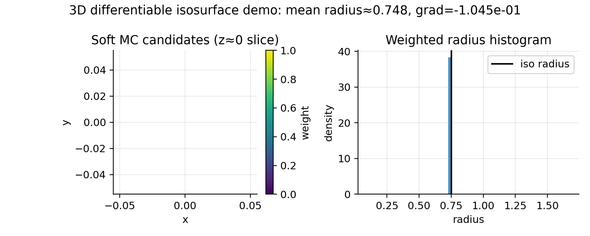

Differentiable isosurfaces (3D)
===============================

Many geometry-extraction steps in coil design are *discrete* (contours, thresholding, mesh extraction).
To enable end-to-end autodiff workflows, ``regcoil_jax`` provides **smooth relaxations** that return
weighted *candidate* points rather than discrete topology.

This page documents the 3D analogue of the 2D tools described in :doc:`differentiable_coil_cutting`.

Soft marching cubes (candidates, JAX)
--------------------------------------------------

The function :func:`regcoil_jax.diff_isosurface.soft_marching_cubes_candidates` takes a 3D vertex grid
``xyz_ijk3`` and a scalar field ``phi_ijk`` and returns:

- candidate isosurface points on grid edges (linear interpolation),
- smooth weights that are large when an edge likely brackets the isovalue.

For an edge with endpoints :math:`(\mathbf{x}_0,\phi_0)` and :math:`(\mathbf{x}_1,\phi_1)`, we define
the linear interpolation parameter

.. math::

   t = \frac{\ell - \phi_0}{\phi_1-\phi_0+\varepsilon},

and the candidate point

.. math::

   \mathbf{p} = (1-\mathrm{clip}(t))\,\mathbf{x}_0 + \mathrm{clip}(t)\,\mathbf{x}_1,

where :math:`\ell` is the isovalue and ``clip`` clamps to :math:`[0,1]`.

The weight is a smooth proxy for the “sign change” test:

.. math::

   w_{\mathrm{cross}} = \sigma\!\left(-\alpha(\phi_0-\ell)(\phi_1-\ell)\right),

optionally multiplied by an “in-range” factor that prefers :math:`t\in[0,1]`.

This is **fully JAX differentiable** with respect to ``xyz_ijk3`` and ``phi_ijk`` (and any parameters
that generate them).

Hard mesh extraction (visualization, NumPy)
-------------------------------------------

For ParaView-friendly triangle meshes without heavy dependencies, ``regcoil_jax`` also includes
:func:`regcoil_jax.isosurface_numpy.marching_tetrahedra_mesh`, a small marching-tetrahedra extractor:

- it is **not differentiable** (discrete case handling),
- it is intended for *visualization output only*,
- it does not deduplicate vertices (each triangle carries its own points).

Example
-------

The example :ex:`examples/2_intermediate/differentiable_isosurface_marching_cubes_demo.py` builds a
synthetic scalar field for a sphere and writes:

- ``vtk/sphere_candidates_soft_marching_cubes.vtp`` (weighted candidate point cloud),
- ``vtk/sphere_mesh_marching_tetrahedra.vtp`` (triangle mesh for visualization),
- ``figures/soft_marching_cubes_demo.png`` (a small diagnostic figure).

Run it from the repository root:

.. code-block:: bash

   python examples/2_intermediate/differentiable_isosurface_marching_cubes_demo.py --platform cpu

