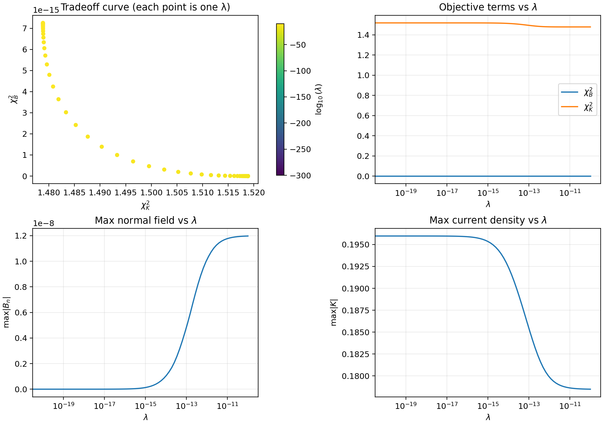

regcoil_jax
===========

JAX port of the Fortran **REGCOIL** codebase (Landreman 2017), with an initial focus on
parity-first correctness while keeping the forward pipeline compatible with JAX JIT + autodiff.

.. image:: _static/regcoil_jax_pipeline.svg
   :alt: regcoil_jax pipeline
   :width: 820

This figure summarizes a **λ scan** (``general_option=1``). Each point corresponds to a different regularization
parameter :math:`\lambda` in the REGCOIL objective:

- small :math:`\lambda` → prioritize small normal-field error :math:`\chi_B^2`,
- large :math:`\lambda` → prioritize “smaller/ smoother” winding-surface currents :math:`\chi_K^2` (and smaller ``max|K|``).

In practice, you choose :math:`\lambda` by scanning this trade-off (or using ``general_option=4/5`` to hit a target such as
``max_K``). See :doc:`theory` for equations and :doc:`usage` for the namelist keys.

.. toctree::
   :maxdepth: 2
   :caption: Contents

   installation
   usage
   io_reference
   theory
   parity
   contributing
   porting_notes
   feature_matrix
   design
   optimization
   quadcoil_objectives
   permanent_magnets
   differentiable_coil_cutting
   differentiable_poincare
   hybrid_design
   visualization
   api
   references
