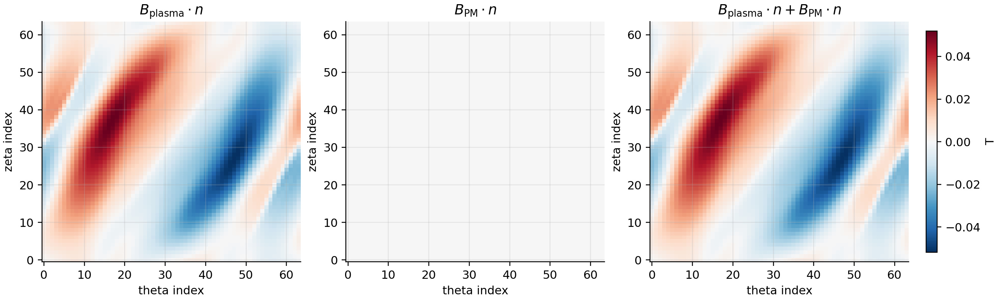
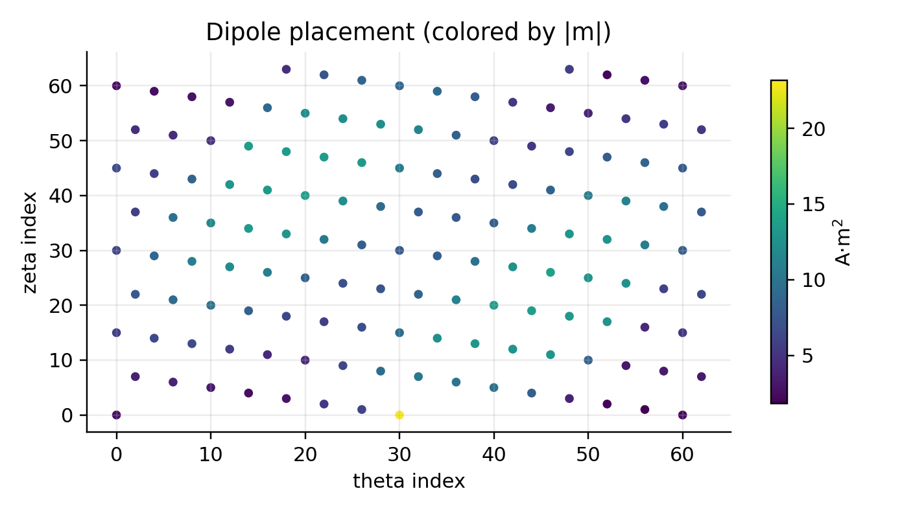
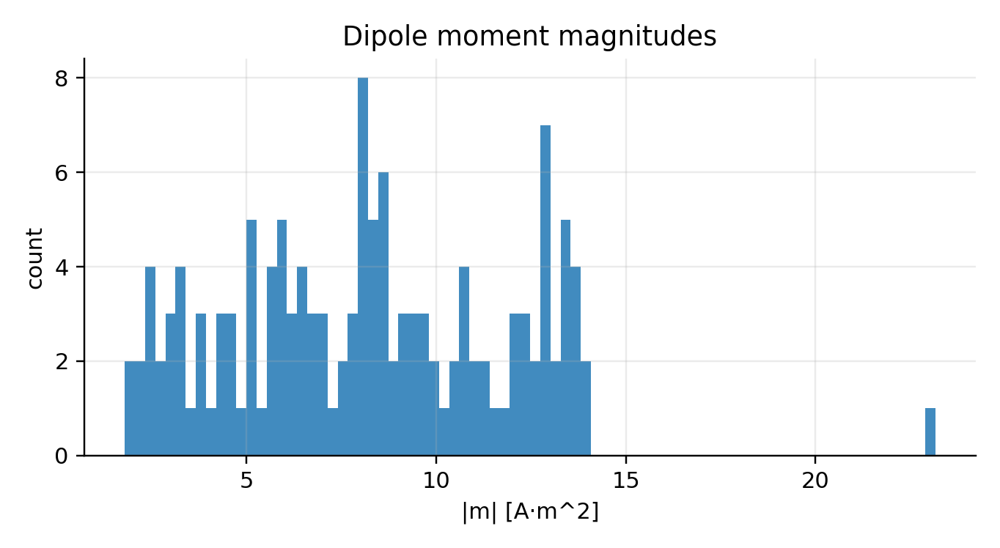

Permanent magnets (dipole lattices)
===================================

This page documents the "REGCOIL-PM-like" capability in ``regcoil_jax``:

*representing permanent magnets (or small local coils) as a lattice of point dipoles and solving
for their moments to cancel the normal field on the plasma surface.*

The key implementation modules are:

* :src:`regcoil_jax/dipoles.py`: point-dipole magnetic field and B·n evaluation (batched, JAX).
* :src:`regcoil_jax/permanent_magnets.py`: least-squares and fixed-magnitude optimization utilities.

Dipole model
------------

A point dipole at position :math:`\mathbf{x}_0` with moment :math:`\mathbf{m}` produces:

.. math::

  \mathbf{B}(\mathbf{x})
  = \frac{\mu_0}{4\pi}
    \left(
      \frac{3\,\mathbf{r}(\mathbf{m}\cdot\mathbf{r})}{|\mathbf{r}|^5}
      - \frac{\mathbf{m}}{|\mathbf{r}|^3}
    \right),
  \qquad \mathbf{r} = \mathbf{x}-\mathbf{x}_0.

The normal component at a surface point with unit normal :math:`\hat{\mathbf{n}}` is
:math:`B_n = \hat{\mathbf{n}}\cdot\mathbf{B}`.

Implementation: :src:`regcoil_jax/dipoles.py` (``dipole_bfield``, ``dipole_bnormal``).

Ridge-regularized least squares (linear solve)
----------------------------------------------

If dipole positions are fixed, :math:`B_n` is a **linear function** of the moments. If we stack all
moments into a vector :math:`m`, we can write:

.. math::

  B_n = A\,m,

for a suitable linear operator :math:`A`.

To cancel a target normal field :math:`b` (e.g. :math:`b = -B_{\mathrm{plasma}}\cdot n`), we solve:

.. math::

  \min_m \|A m - b\|_2^2 + \alpha\|m\|_2^2,

which leads to the normal equations

.. math::

  (A^\top A + \alpha I)\,m = A^\top b.

Implementation: :src:`regcoil_jax/permanent_magnets.py` (``solve_dipole_moments_ridge_cg``).

Notes:

* We use conjugate gradients (CG) on the normal equations.
* We apply :math:`A^\top` using JAX reverse-mode autodiff (VJP), so we do not have to explicitly
  assemble a dense matrix :math:`A` for large problems.

Fixed-magnitude magnets (smooth relaxation)
------------------------------------------------

Often magnets are constrained to a fixed magnitude :math:`\|\mathbf{m}_i\| = m_0`.
This constraint is non-linear. We provide a smooth, differentiable relaxation by parameterizing

.. math::

  \mathbf{m}_i = m_0\,\frac{\mathbf{v}_i}{\|\mathbf{v}_i\|}.

and optimizing the unconstrained :math:`\mathbf{v}_i` with gradient descent / Adam.

Implementation: :src:`regcoil_jax/permanent_magnets.py` (``optimize_dipole_orientations_fixed_magnitude``).

Example
-------

Run the pedagogic end-to-end demo:

.. code-block:: bash

  python examples/3_advanced/permanent_magnets_cancel_bplasma.py --platform cpu

This script:

1. runs ``regcoil_jax`` on an input with ``load_bnorm=.true.`` to obtain ``Bnormal_from_plasma_current``,
2. places dipoles on an offset winding surface,
3. solves for dipole moments to cancel :math:`B_{\mathrm{plasma}}\cdot n`,
4. writes figures and ParaView VTK outputs.

Typical “paper-style” outputs
-----------------------------

The example produces a three-panel map of:

- :math:`B_{\mathrm{plasma}}\cdot n` (before),
- :math:`B_{\mathrm{PM}}\cdot n` (from magnets),
- the residual :math:`B_{\mathrm{plasma}}\cdot n + B_{\mathrm{PM}}\cdot n` (after),

as well as histogram/scatter diagnostics of the resulting dipole moment distribution.

ParaView assets
----------------

The example writes:

- ``vtk/plasma_surface.vts`` with point-data ``Bn_plasma``, ``Bn_pm``, and ``Bn_residual``.
- ``vtk/winding_surface.vts`` for reference.
- ``vtk/dipoles.vtp`` as a point set with vector point-data ``m`` and scalars ``m_mag`` and ``m_dot_ncoil``.

In ParaView:

- load the surfaces and color by ``Bn_residual``,
- load ``dipoles.vtp`` and use *Filters → Glyph* with vector ``m`` to visualize magnet orientations,
- color glyphs by ``m_mag`` to show the moment distribution.

Reproducibility metadata
------------------------

The example also writes ``run_summary.json`` in the output directory, containing the key parameters
(dipole stride/offset, ridge weight, iteration limits) and simple residual metrics (RMS and max :math:`|B_n|`).

See also
--------

- :ex:`examples/3_advanced/permanent_magnets_cancel_bplasma.py` (full script)
- :doc:`references` for permanent-magnet and coillet literature pointers.
