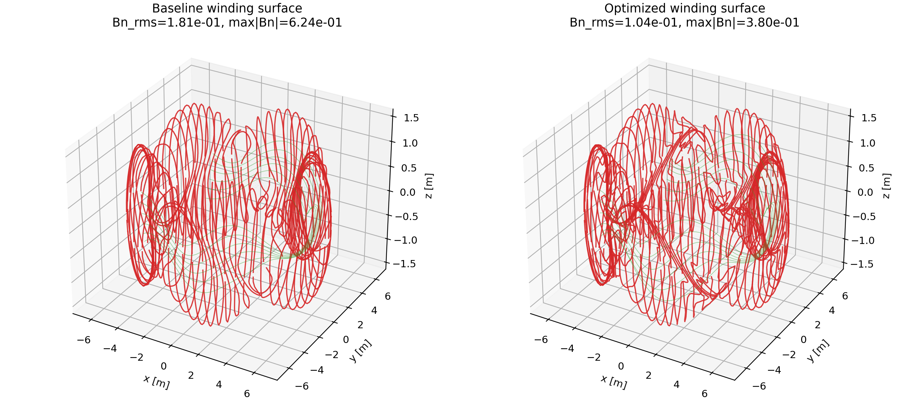

Visualization and Coil Cutting
==============================

Publication-ready figures
------------------------------

The repository includes a pedagogic postprocessing script that generates figures from a run:

::

  python examples/3_advanced/postprocess_make_figures_and_vtk.py --run \\
    --input examples/3_advanced/regcoil_in.lambda_search_1

You can disable figure or VTK output independently:

::

  python examples/3_advanced/postprocess_make_figures_and_vtk.py --run --no_figures \\
    --input examples/3_advanced/regcoil_in.lambda_search_1
  python examples/3_advanced/postprocess_make_figures_and_vtk.py --run --no_vtk \\
    --input examples/3_advanced/regcoil_in.lambda_search_1

It writes:

- ``figures_<case>/``: PNG figures (lambda scan, 2D maps of :math:`B_n`, :math:`|K|`, and :math:`\\Phi`)
- ``vtk_<case>/``: ParaView-readable ``.vtp`` PolyData files

Example 3D summary figure
-------------------------

The end-to-end VMEC demo :ex:`examples/3_advanced/compare_winding_surface_optimization_cut_coils_currents_poincare.py`
also writes a single “paper-style” 3D overview figure that overlays:

- a plasma surface point cloud,
- the cut filament coils (colored by current sign),
- a few traced coil-only field lines,

both **before** and **after** winding-surface optimization.

Optimization example figures
----------------------------

The autodiff example :ex:`examples/2_intermediate/jax_optimize_coil_radius_full_regcoil.py` writes:

- ``outputs_optimize_coil_radius/``: PNG optimization-history figures and ``.vts`` winding-surface snapshots (initial/final).

Winding-surface before/after (ParaView)
---------------------------------------

The advanced autodiff example :ex:`examples/3_advanced/winding_surface_autodiff_optimize_and_visualize.py` writes two full runs:

- ``regcoil_in.winding_surface_autodiff_before`` and corresponding VTK under ``vtk_winding_surface_autodiff_before/``
- ``regcoil_in.winding_surface_autodiff_after`` and corresponding VTK under ``vtk_winding_surface_autodiff_after/``

Open both ``coil_surface.vtp`` files in ParaView and compare scalars like ``Kmag`` and ``Phi``.

You can disable outputs:

::

  python examples/2_intermediate/jax_optimize_coil_radius_full_regcoil.py --no_figures
  python examples/2_intermediate/jax_optimize_coil_radius_full_regcoil.py --no_vtk

VTK / ParaView
--------------

The postprocessing script writes these VTK files:

- ``coil_surface.vtp``: winding surface mesh with point-data (e.g. ``Phi``, ``Kmag``)
- ``plasma_surface.vtp``: plasma surface mesh with point-data (e.g. ``Bnormal``)
- ``coil_surface.vts`` and ``plasma_surface.vts``: structured-grid versions of the same surfaces
- ``coils.vtp``: filamentary coils obtained by cutting contours of the current potential
- ``fieldlines.vtp``: field line traces of the *filament-coil* approximation
- ``poincare_points.vtp`` (optional): Poincaré section points (a point cloud with a ``line_id`` scalar)
- ``B_point_cloud.vtu`` (optional): point cloud of ``B``/``Bmag`` in a 3D box (coil-filament field only)

Open them in ParaView and use the normal visualization pipeline (surface coloring, clipping, etc).

Cutting coils (filament extraction)
-----------------------------------

REGCOIL represents the coil currents as a surface current density
:math:`\mathbf{K} = \mathbf{n} \times \nabla \Phi` on a winding surface.

To obtain discrete filament coils, a standard approach is to take contours of the total current potential
:math:`\Phi(\theta,\zeta)`.

This repository includes a small implementation in :src:`regcoil_jax/coil_cutting.py` and exposes it through
the postprocessing script above, which also writes a MAKECOIL-style ``coils.<case>`` file.

The MAKECOIL writer supports a **different current per coil** (each filament can have its own current value).
This is used in the autodiff example :ex:`examples/2_intermediate/jax_optimize_cut_coil_currents_and_visualize.py`.

Field line tracing
------------------

The field line example uses a simple Biot–Savart midpoint rule on straight segments (coil filaments only),
implemented in :src:`regcoil_jax/fieldlines.py`. This is intended for visualization and sanity checks.

The shared postprocess script supports tracing in JAX with ``--jax_fieldlines``.

JAX-native field lines (for autodiff)
-------------------------------------

For optimization workflows, it can be useful to keep the *field line integration* in JAX so it can be used inside
autodiff-based objectives. This repo includes a JAX RK4 tracer:

- :src:`regcoil_jax/fieldlines_jax.py` (``trace_fieldlines_rk4``)

and a differentiable *soft Poincaré* helper:

- ``poincare_section_weights`` and ``poincare_weighted_RZ``

Exact Poincaré crossing extraction (detecting discrete crossings) remains a visualization-first tool
in :src:`regcoil_jax/fieldlines.py`.

Example demo (prints gradient norms):

::

  python examples/3_advanced/jax_poincare_grad_demo.py

See also:

- :doc:`differentiable_poincare` for a full derivation and a practical optimization example.

Poincaré sections
-----------------

The postprocessing script can also extract a Poincaré section at a fixed toroidal angle :math:`\phi_0`
(mod :math:`2\pi/N_{fp}`)::

  python examples/3_advanced/postprocess_make_figures_and_vtk.py --run \\
    --input examples/3_advanced/regcoil_in.lambda_search_1 \\
    --poincare --poincare_phi0 0.0

For a one-command wrapper that enables Poincaré output by default::

  python examples/3_advanced/full_solve_cut_coils_and_poincare.py

Advanced Poincaré demos
-----------------------

Two additional scripts generate Poincaré plots **overlaid with the target surface slice**:

- :ex:`examples/3_advanced/compare_winding_surface_optimization_cut_coils_currents_poincare.py`:
  compares a baseline winding surface vs an autodiff-optimized winding surface, including coil cutting and per-coil
  current optimization.
- :ex:`examples/3_advanced/hybrid_few_loops_many_dipoles_optimize_and_poincare.py`:
  optimizes a hybrid field from a few loops plus many dipoles and overlays the Poincaré section with the target surface.
